# 4. Software and Hardware Guide

## 4.1 ESP32 Controller

### 4.1.1 ESP32 Controller Overview

This is a smart controller based on the ESP32 core that supports both graphical programming and Python programming. Enclosed in a PC plastic shell, it features on-board electronic modules such as PWM servo ports, motor ports, programmable buttons, and a buzzer, along with multiple reserved sensor ports for high expandability. The standardized 4-pin anti-reverse ports fit the entire series of Hiwonder sensors, ensuring easy and safe operation.


### 4.1.2 ESP32 Controller Interface Overview


### 4.1.3 ESP32 Controller Specifications

| Product Name | Details |
| :--- | :--- |
| Product name | ESP32 Controller |
| Dimensions | 88.0 x 55.5 x 42.5 mm |
| Charging voltage | 5 V |
| Charging current | 1500 mA |
| Charging time | 3.5 h |
| Battery capacity | Two 1200 mAh 3.7 V lithium batteries |
| Maximum operating voltage | 8.4 V |
| Rated operating voltage | 7.4 V |

## 4.2 WonderCode Programming Software

### 4.2.1 Software Installation Package

- [Windows(x64)](https://drive.google.com/file/d/1X8SvOM01UXOM2IvFwN_Ty7Ert5NPqZr8/view?usp=sharing)

- [Mac](https://drive.google.com/file/d/1u-Yb7KiG7Qiu0cd9HIQbZjNCbts9Dzqv/view?usp=sharing)

### 4.2.2 Install Programming Software

1. Open the **WonderCode setup.exe** software installation package.


2. Select the language, then click **OK**.


3. Select the installation location, then click **Next**.


4. Click **Next**.


5. Click **Install**.


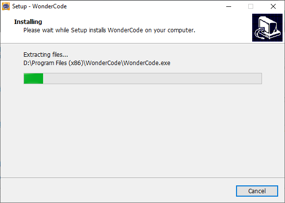

6. After successful installation, click **Finish**.


### 4.2.3 Programming Platform Overview

WonderCode is a Scratch programming software tool designed specifically for Hiwonder products. The software supports automatic conversion between graphical command blocks and Python code. Programming can be performed by dragging and dropping command blocks, making it ideal for beginners learning to program.


### 4.2.4 Platform Interface Overview

The figure below shows the functional areas of the WonderCode software, including ① Menu Bar, ② Command Area, ③ Script Area, and ④ Code Display and Upload Area.

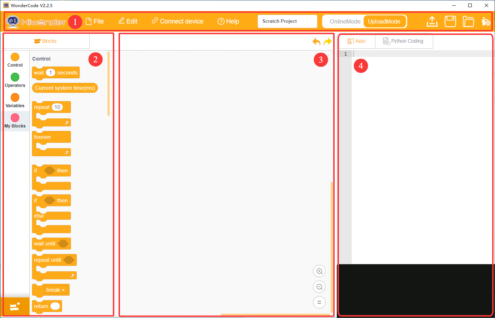

The corresponding functions are listed in the table below:

| Icon | Function |
| :---: | :--- |
|  | Create, save, and open program files. |
|  | Used for online mode, only for reference without requiring mastery. |
|  | Determine whether to connect the device to the software and select the connection port. |
|  | Find help materials, check for updates, and install drivers. |
|  | Display the program file name, showing **Scratch Project** when programming has not started or the file is unsaved. |
|  | Interface switch button to toggle between **Online Mode** and **Upload Mode**. |
|  | Select the interface display language, supporting English, Simplified Chinese, and Traditional Chinese. |
|  | Undo or redo operations when writing programs. |
|  | Editing mode switch button. The **Auto** button converts block programs into Python format, and switching to **Python Coding** allows editing programs directly using Python. |
|  | Save the program as Python code. |
|  | Open saved Python files. |
|  | Perform device interaction to download the program to the controller board. |
|  | Used to add extension packages for the device. |
|  | Zoom in, zoom out, and restore the default size of the code editing interface from top to bottom. |

### 4.2.5 Basic Blocks Overview

| Block | Category | Function Description |
| :---: | :---: | :--- |
|  | 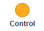 | Pause the program for a specified duration before executing subsequent code, used for action intervals and delay buffering. |
|  |  | Read the total running time in milliseconds since the device was powered on, used for timing and delay judgment logic. |
|  |  | Limit the code execution inside the loop to run a specified number of times, and exit the loop when completed. |
|  |  | Run the nested blocks inside the loop infinitely, repeating internal loop logic continuously. |
|  |  | Basic conditional judgment. Execute internal code when the condition is met, and skip directly when not met. |
|  |  | Two-branch conditional judgment. Execute code inside "then" when the condition is met, and execute code inside "else" when not met. |
|  |  | Customize the input delay value to pause the program for the corresponding duration. |
|  |  | Execute internal code repeatedly in a loop until the specified condition is met to exit the loop. |
|  |  | Terminate the current loop structure early and exit the loop directly to execute subsequent programs. |
|  |  | Used inside custom functions to return specified data to the function caller. |
|  |  | Perform addition on two values and return the result. |
|  |  | Perform subtraction on two values and return the result. |
|  |  | Perform multiplication on two values and return the result. |
|  |  | Perform division on two values and return the result. |
| 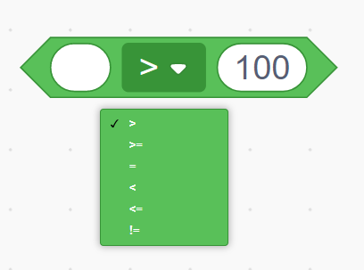 |  | Compare the size of two numbers and return a boolean value representing whether the comparison is true or false. |
|  |  | Logical AND operation. The overall result is true only when all conditions are met. |
|  |  | Logical OR operation. The overall result is true if any of the conditions are met. |
|  |  | Boolean NOT operation to invert the original true or false condition. |
|  |  | Boolean logical judgment to determine whether input conditions are true or false, or perform a NOT operation. |
|  |  | Determine whether a specified element exists in an array, tuple, or dictionary, and return a boolean result. |
|  |  | Extract corresponding stored numerical or text content from a dictionary according to a specified key name. |
|  |  | Linearly convert and map input values from the original numerical range to the target range to complete value range conversion. |
|  |  | Customize input or call text content to generate string data for concatenation, judgment, and display. |
|  |  | Concatenate and merge two text strings to output complete combined text. |
|  |  | Convert input numerical values into corresponding text character formats, used for text display and string concatenation scenarios. |
|  |  | Create a custom-named variable container to store single pieces of data such as numbers or text. |
|  |  | Read data stored inside created variables, which can participate in operations, judgments, and output operations. |
|  |  | Assign a value to a specified variable to overwrite original data and modify variable content to the set value. |
|  |  | Perform self-increment operations on numerical variables, adding specified numbers to original values. |
|  |  | Create a blank list with a custom name to store multiple sets of data in batches. |
|  |  | Generate a blank list container to store multiple types of data such as numbers and text for subsequent adding, deleting, modifying, and querying operations. |
|  |  | Clear all stored elements in the target list to reset the list to an empty list. |
|  |  | Insert custom content in front of the element at the specified index in the target list to complete list element insertion. |
|  |  | Customize and create function blocks, set function names and input parameters of number or text types, used to encapsulate a segment of program logic for reuse. |
|  |  | Provide number or text type parameter input values for custom functions for internal program calls inside functions. |
|  |  | Call defined custom function blocks to execute all program code encapsulated inside that function. |
|  |  | Create custom function blocks to encapsulate a segment of repeatable program logic. |
|  |  | Call defined custom functions to execute all programs encapsulated inside the function. |

### 4.2.6 ESP32 Controller Extension Library Overview

| Block | Category | Function Description |
| :---: | :---: | :--- |
|  |  | Main program loop container. Continuously execute internal code after power-on initialization is completed. |
|  |  | Execute only once after device power-on, used to place power-on logic such as hardware initialization and parameter configuration. |
|  |  | Drive the buzzer to play music of specified pitch and beat, without blocking subsequent program execution when running in background mode. |
|  |  | Adjust buzzer volume with value range 0 to 100, where larger values indicate higher volume. |
|  |  | Stop buzzer sound immediately, terminating currently playing tone or music. |
|  |  | Control specified index or all RGB lights to turn on and light up in selected color. |
| 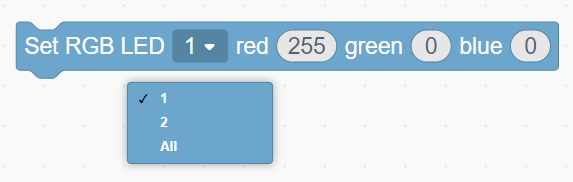 |  | Customize light color through RGB three-channel values to control corresponding lights to output mixed color light. |
|  |  | Make specified RGB lights execute brightness gradient breathing effects in selected color with customizable light and dark transition cycles. |
|  |  | Turn on flowing colorful light effects where RGB lights automatically and cyclically transition through multiple colors. |
|  |  | Turn off specified index or all RGB lights to cut off light output. |
|  |  | Print and output custom text strings to computer via serial port, used for debugging and viewing information. |
|  |  | Print and output specified numerical values to computer via serial port, used for data debugging and printing. |
|  |  | Terminate rotation of 360° servos at specified ports immediately to stop servo operation. |
|  |  | Control 360° servos at specified ports to rotate continuously at custom set speeds. |
|  |  | Control 270° servos at specified ports to rotate smoothly to target angles within set durations with automatic delay waiting for servos to complete action. |

<a id ="section-4-3"></a>

## 4.3 Electronic Module Tutorials

### 4.3.1 360° Block Servo

#### (1) Overview

This is a servo compatible with various LEGO building block components. During operation, pulse width modulation, also known as PWM, is generally used for control. It is a continuous rotation servo where rotation speed and direction can be controlled through PWM signals, but specific rotation angles cannot be controlled.

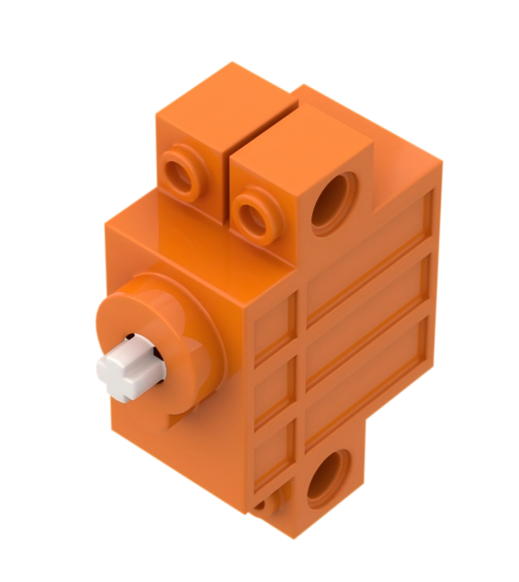

#### (2) Specifications

| Parameter | Details |
| :--- | :--- |
| Operating voltage | DC 4.8-6 V |
| Rated torque | 1N·m |
| Rotation range | 0° to 360° |
| Cable length | 25 cm |
| Dimensions | 40 × 16 mm |

#### (3) Wiring Diagram

Connect the 360° block servo to controller ports **S1~S6**. Pay attention that the **orange** wire connects to **S**, the **red** wire connects to **5 V**, and the **brown** wire connects to **GND**, as shown in the figure below:


#### (4) Practical Examples

Case: Servo Forward and Reverse Rotation with Delay Start and Stop
Program logic: After downloading the program, the 360° block servo will rotate forward at a speed of 50 for 2 seconds, rotate backward for 2 seconds, and finally stop.

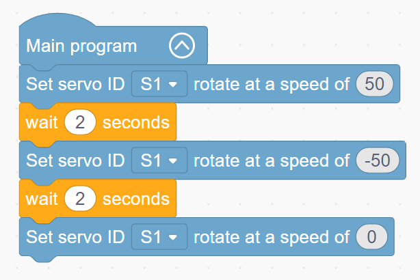

Program download instructions: Follow the animated image to click **Connect device**, select the port, then click the upload button to complete the program download and test the program execution effect.


> [!NOTE]
>
> * **The program in the figure uses the block Set Servo S1 to Rotate at Speed 50 because PWM signals are required to control the rotation of the 360° block servo. Since the PWM signal output ports on the controller are `S1` to `S6`, port `S1` is used here to send signals to the 360° block servo.**
>
> * **The source files are available for download under [1. Source Code / 03 Program Files for Starter Projects](https://drive.google.com/drive/folders/1C_cT51H9adfUnSPw9l57vPrQQ2A_vUBa?usp=sharing).**
>

### 4.3.2 270° Block Servo

#### (1) Overview

This is a servo compatible with various LEGO building block components. During operation, pulse width modulation, also known as PWM, is generally used for control. It is a limited rotation servo, meaning the servo can control the rotation angle within a limited range from 0° to 270°.

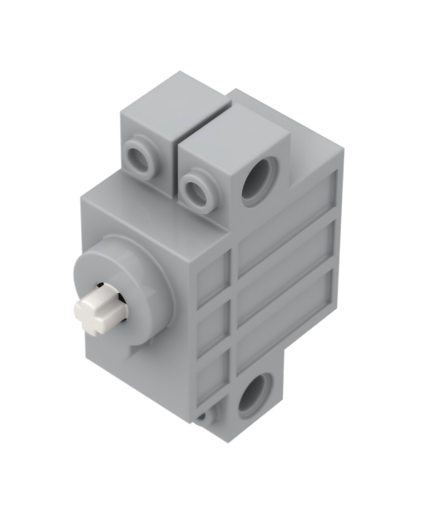

#### (2) Specifications

| Parameter | Value |
| :--- | :--- |
| Operating voltage | DC 4.8-6 V |
| Rated torque | 1N·m |
| Rotation range | 0° to 270° |
| Cable length | 25 cm |
| Dimensions | 40 × 16 mm |

#### (3) Wiring Diagram

Connect the 270° servo to controller ports **S1~S6**. Pay attention that the **orange** wire connects to **S**, the **red** wire connects to **5 V**, and the **brown** wire connects to **GND**, as shown in the figure below:


#### (4) Practical Examples

Case: 270° Servo Multi-angle Delayed Rotation
Program logic: After downloading the program, the 270° block servo first rotates to 135°, rotates to 0° after 2 seconds, rotates to 270° after 2 seconds, and stops after 2 seconds.


Program download instructions: Follow the animated image to click **Connect device**, select the port, then click the upload button to complete the program download and test the program execution effect.


> [!NOTE]
>
> * **Initial reset must be performed before using the 270° servo.**
>
> * **The source files are available for download under [1. Source Code / 03 Program Files for Starter Projects](https://drive.google.com/drive/folders/1C_cT51H9adfUnSPw9l57vPrQQ2A_vUBa?usp=sharing).**
>

### 4.3.3 Dot Matrix Module

#### (1) Overview

This is an LED dot matrix display module featuring high display brightness, flicker-free display, and convenient wiring, which can display numbers, text, patterns, and other content. The module also integrates LEGO-compatible holes to support more creative DIY designs.

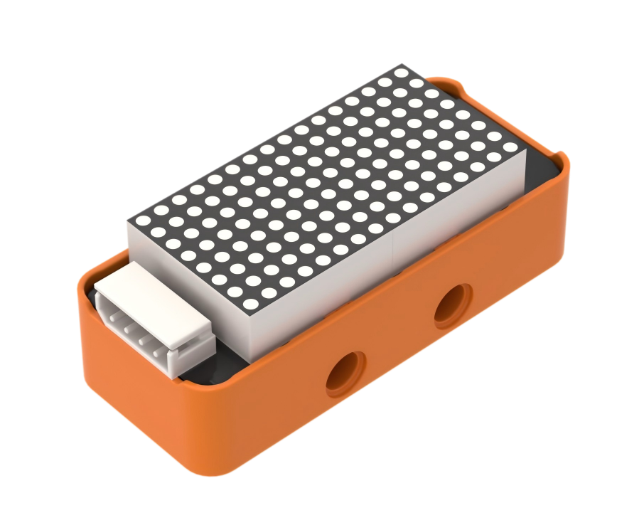

#### (2) Specifications

| Parameter | Details |
| :--- | :--- |
| Operating voltage | DC 5 V |
| Operating current | 45 mA |
| Matrix pixels | 8×16 dot matrix |
| Matrix brightness | 8 adjustable brightness levels |
| Interface model | 5264-4AW |
| Dimensions | 55.5 × 23.5 × 18.1 mm |

#### (3) Wiring Diagram


- **It supports connection to any port among P5, P6, P7, and P8 on the controller.**

#### (4) Practical Examples

Case: Dot Matrix Screen Loop Graphic and Text Display
Program logic: After downloading the program, control the dot matrix screen to cycle through displaying "Hi", "123", and "❤".


Program download instructions: Follow the animated image to click **Connect device**, select the port, then click the upload button to complete the program download and test the program execution effect.


> [!NOTE]
>
> * **When using the dot matrix module, initialization of the dot matrix module interface is required at startup.**
>
> * **The source files are available for download under [1. Source Code / 03 Program Files for Starter Projects](https://drive.google.com/drive/folders/1C_cT51H9adfUnSPw9l57vPrQQ2A_vUBa?usp=sharing).**
>

### 4.3.4 Fan Module

#### (1) Overview

This is a fan module that does not require an additional motor driver board, featuring adjustable rotation speed. Combining it with a temperature sensor allows the creation of a smart fan device that automatically adjusts fan speed based on different temperatures. Meanwhile, the module integrates LEGO-compatible holes on the board for more creative DIY designs.


#### (2) Specifications

| Parameter | Details |
| :--- | :--- |
| Operating voltage | DC 5 V |
| Control method | PWM pulse control |
| Interface model | 5264-4AW |
| Dimensions | 64.3 × 41.8 × 25.0 mm |

#### (3) Wiring Diagram


- **It supports connection to any port among P5, P6, P7, and P8 on the controller.**

#### (4) Practical Examples

Case: Fan Timed Start and Stop Control
Program logic: After downloading the program, the fan rotates at a speed of 60, and stops rotating after 10 seconds.


Program download instructions: Follow the animated image to click **Connect device**, select the port, then click the upload button to complete the program download and test the program execution effect.


> [!NOTE]
>
> * **When using the fan module, connecting to either port P5 or P8 is recommended to avoid fan rotation upon power-on caused by the initial high electrical level of controller ports.**
>
> * **The source files are available for download under [1. Source Code / 03 Program Files for Starter Projects](https://drive.google.com/drive/folders/1C_cT51H9adfUnSPw9l57vPrQQ2A_vUBa?usp=sharing).**
>


<a id ="section-4-4"></a>

## 4.4 WonderLLM Module

### 4.4.1 Module Overview

#### 1. Module Introduction

WonderLLM is a large AI model module featuring a built-in ESP32-S3 high-performance chip. It integrates a 2-megapixel HD camera, microphone, HD display screen, speaker, and CI1302 voice recognition chip, deeply integrating multimodal models including text, voice, and vision.

Featuring easy operation, the module is often paired with robots, providing robots with a super brain that deeply understands commands and delivers outstanding perception, reasoning, and action capabilities to create flexible and natural human-robot interaction experiences.


#### 2. Operating Principles

- The module adopts a voice command wake-up mode, requiring the wake word to be spoken to wake up WonderLLM, after which human-machine interaction can begin. To switch to English recognition, the English recognition firmware must be flashed. After switching to the English firmware, the English wake keyword is **Hello Hiwonder**.

- Once the module recognizes the wake word, the buzzer beeps once, after which interaction can begin. The module supports communication in English. If no voice is recognized within 1 minute, sleep mode is entered, requiring another wake-up command for subsequent use.

#### 3. Hardware Interface Overview


| Number | Description |
| :---: | :--- |
| 1 | Type-C interface, top, used for flashing program firmware to the ESP32-S3 chip |
| 2 | Type-C interface, bottom, used for flashing voice recognition firmware to the CI1302 chip |
| 3 | 4-PIN I2C communication interface, available for secondary development |
| 4 | Capacitive touch screen, used to display images and adjust volume |
| 5 | Left button, used for switching module expressions or chat modes |
| 6 | HD camera, capable of capturing real-time images |
| 7 | Right button, used for module network configuration and interaction control |

#### 4. Notes

1. Use a 5 V power supply, otherwise the module will be damaged.

2. Ensure a quiet operating environment, as noisy environments will affect recognition performance.

3. Speak commands clearly and at a moderate pace, maintaining a distance within 5 meters from the module.

### 4.4.2 Module Configuration

<a id ="section-4-4-2-1"></a>

#### (1) Power On

1. The module supports power supply through the following interfaces: **① the top Type-C interface**, **② the bottom Type-C interface**, and **③ 4-PIN I2C communication interface**. Select any interface to connect an external power supply, and the module powers on automatically.

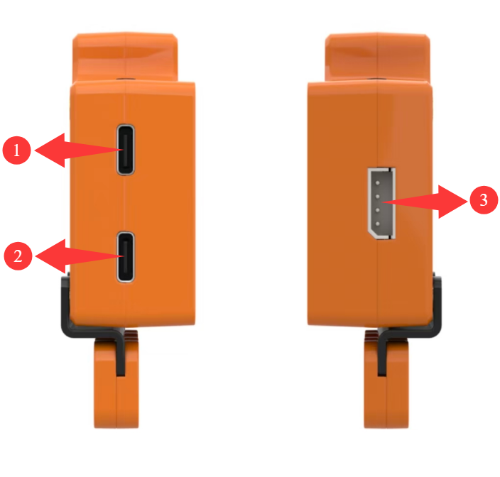

2. After power-on, the screen displays the **Device Hotspot Name** and **Browser Network Configuration URL**, accompanied by voice announcements. Follow the [Module Network Connection](#section-4-4-2-2) section to complete module networking first.


3. After network configuration, binding with the platform agent is required. The module screen displays the **Device ID** and **Device Binding Platform URL,** accompanied by voice announcements of the binding verification code. Follow the [Device Binding](#section-4-4-2-3) section to complete module device binding.


4. After power-on, if device binding is completed, a white circular progress bar is displayed on the screen while the module automatically connects to the network using internal Wi-Fi information. If the network connection fails, the screen displays the **Device Hotspot Name** and **Browser Network Configuration URL**, accompanied by voice announcements. Follow the [Module Network Connection](#section-4-4-2-2) section to configure new Wi-Fi connection information available in the current environment again.

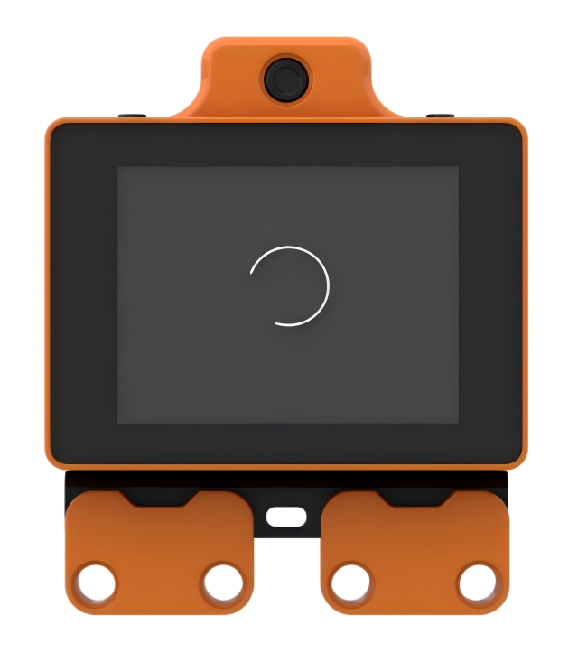

5. After power-on, if device binding is completed and configured Wi-Fi information is available in the current environment, the network connects successfully after the white circular progress bar loads, jumping to the module expression display interface. All module configurations are normal at this point, and human-machine interaction can begin after waking up the module.


<a id ="section-4-4-2-2"></a>

#### (2) Module Network Connection

- **Operation Description**

Three situations cause the module to enter network configuration mode: ① initial module use or firmware reflashing without saved Wi-Fi connection information in memory, ② no matching hotspot in the current environment for stored Wi-Fi connection information, and ③ manual operation entering network configuration mode by long pressing button B.

- **Operation Steps**

1. Network connection starts after module power-on. The screen displays **Device Hotspot Name** and **Browser Network Configuration URL** accompanied by voice announcements. The large model module opens its built-in hotspot for connection configuration. Hotspot names differ across devices with a unified format **Robot-xxxx**. The hotspot Robot-B7B9 is used as an example below.


2. Search for the corresponding hotspot using a computer or phone and connect, noting that the hotspot has no password.


3. Click the hyperlink [Network Configuration](http://192.168.4.1/) to access the device network configuration URL directly, or copy the URL below and open any browser to enter the device network configuration URL.

```py
http://192.168.4.1
```


4. Enter the hotspot name for automatic connection upon power-on in field ① in the figure below, and enter the hotspot connection password in field ②. Finally click **Connect** in field ③. The module attempts to find matching hotspots in the current environment and connect based on the provided hotspot information.


5. A list of available hotspots in the current environment scanned by the module can be found in the interface. Click any item to automatically fill the corresponding hotspot name into location ①, saving time and convenience.


6. If the following prompt appears on the interface, it indicates that the hotspot cannot be found in the current environment or the password is incorrect. Please re-enter.


7. If the following prompt appears on the interface, it indicates that the module successfully found the corresponding hotspot and connected. The module restarts automatically and connects to the corresponding hotspot.

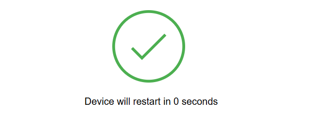

> [!NOTE]
>
> * **Do not enter hotspots that cannot be searched in the current environment, have weak signals, or do not support network connection.**
>
> * **If the module has previously saved connection information for other hotspots, newly saved hotspot connection information will coexist. Upon next power-on, the module reads each connection item in order of saving to attempt matching and connection.**
>
> * **If the screen displays "Error: Failed to check for new version, will retry in xx seconds" after network configuration, it may be because the current hotspot cannot access the Internet or has poor network quality. Please try switching.**
>

- **Manually Enter Network Configuration Mode**

1. The WonderLLM module supports manually entering network configuration mode to meet requirements for selecting module connection hotspots.

2. After module power-on, long press the right button to send a restart command to the module. The screen turns off upon receiving the command. Continue holding the long press. After restarting, the module attempts to connect to hotspots and a white circular progress bar appears on the screen. Detecting that the right button is long-pressed, the module stops matching external hotspots and enters network configuration mode directly, at which point the button can be released.

3. Existing hotspot configuration information is not lost after entering network configuration mode. Access the network configuration page or short press the right button to exit network configuration mode.

4. After exiting network configuration mode, the module continues attempting connection based on saved hotspot information. If connection to external hotspots fails, network configuration mode is re-entered.

- **Manage Saved Connection Configurations**

1. When the module is in network configuration mode, after connecting to the module hotspot and entering the network configuration interface, a list of all saved hotspot connection configurations is displayed if connection information was configured previously, as shown below:


2. Click the  icon corresponding to any saved hotspot connection information to delete it. Click the  icon to raise its matching priority order during module network configuration, where priority decreases from top to bottom in the list.

<a id ="section-4-4-2-3"></a>

#### (3) Device Binding

- **Operation Description**

After module power-on and network configuration, if used for the first time, the screen displays the **6-Digit Device ID** and **Device Binding Platform URL** accompanied by voice announcements. Complete module device binding with the platform agent according to the tutorial below.


- **Operation Steps**

1. Click the hyperlink [XiaoZhi AI Chatbot](https://xiaozhi.me/) to access the device binding URL directly, or copy the URL below and open any browser to enter the device binding URL.

```py
https://xiaozhi.me
```


2. Click **Console** to enter the XiaoZhi AI agent management platform.


3. Upon initial login, register a platform account first.


4. After filling in corresponding information, click **Send code** to obtain the verification code required for account registration.


5. Check the agreement and privacy policy, then click **Login**.

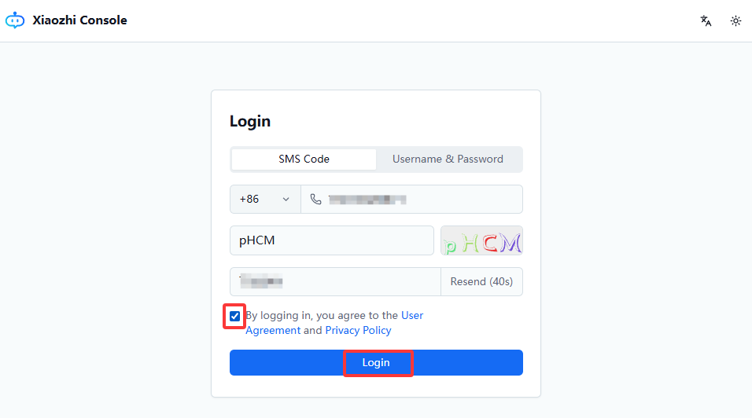

6. Select and complete corresponding information, then click **Confirm** to complete registration and login.

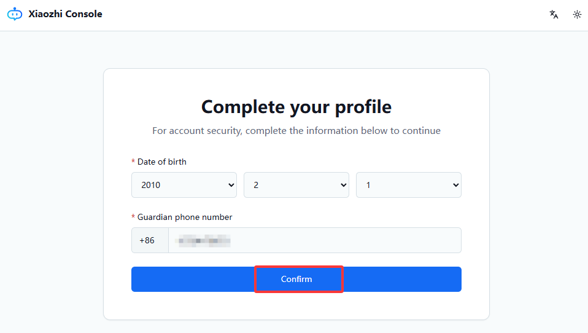

7. After completing registration and login, enter the following interface.

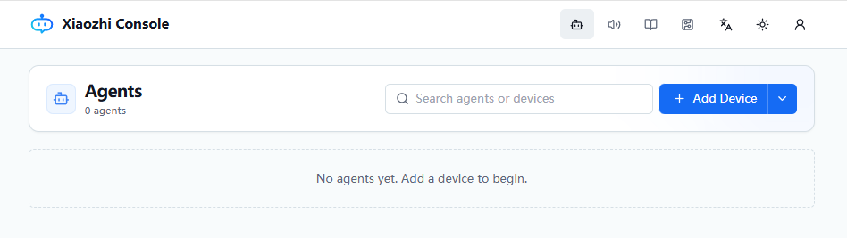

8. Click the **∨** shaped button at the add device button location, then click **Create Agent**.


9. Enter the agent name, then click **Confirm** to complete agent addition.


10. Click **Configure** to perform feature configurations for the agent.


11. Click **Role** to perform role configuration for the agent. Select the desired dialogue language at location ①, select the desired role voice at location ②, and perform voice settings at location ③.


12. Click **Model & Memory**, select **Xiaozhi Lite** for the language model, turn off the memory feature, and keep default selections for others.


> [!NOTE]
>
> **If the account has not completed developer certification on the XiaoZhi AI platform, only lower performance models such as Xiaozhi Lite can be selected by default. To use higher performance models such as Qwen 3.6 or DeepSeek V4, complete certification on the XiaoZhi AI platform according to [Platform Developer Certification](#section-4-4-2-5) before reselecting here.**

13. Click **Extensions** to enable or disable official service functions, which are enabled by default for new agents, then click **Save**.


14. Click **Devices** to enter the device management function.

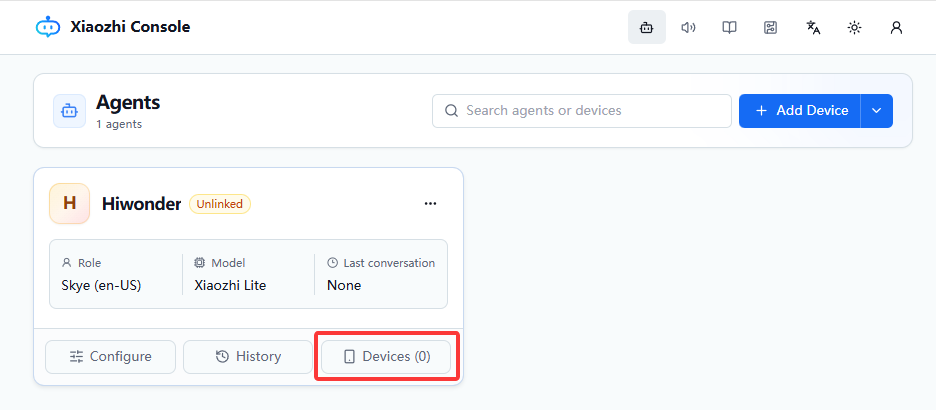

15. Click **Link new device**, fill in the **6-digit device ID** in the pop-up window, then click **Link**.

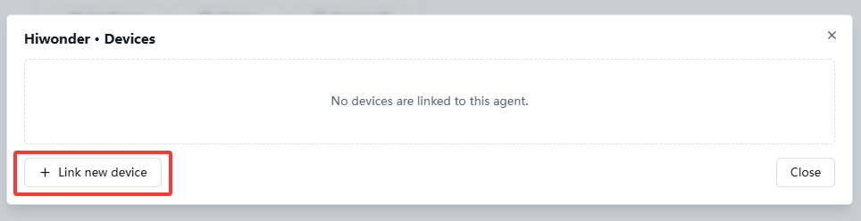


16. Upon successful binding, the prompt **Device Added Successfully** can be observed on the page. Next select **Open Source Version**, then click **Start Using**.

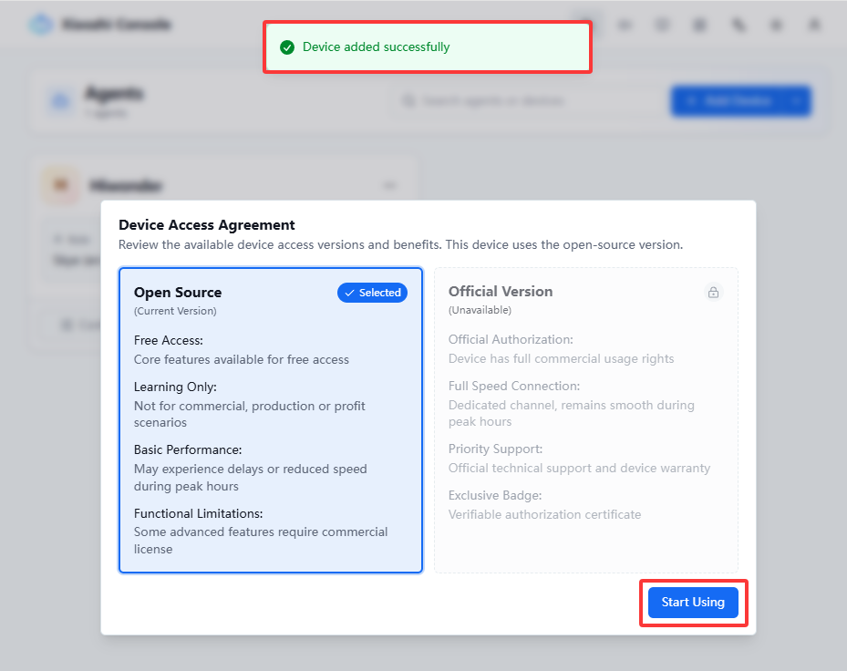

<a id ="section-4-4-2-4"></a>

#### (4) Device Unbinding

- **Operation Description**

To unbind a device, refer to the following operations for device unbinding.

- **Operation Steps**

1. Click the hyperlink [XiaoZhi AI Chatbot](https://xiaozhi.me/) to access the device binding URL directly, or copy the URL below and open any browser to enter the device binding URL.

```py
https://xiaozhi.me
```


2. Click **Console** to enter the XiaoZhi AI agent management platform.


3. Click **Devices** to enter the device management function.


4. Locate the device to unbind, click the corresponding  icon, then click **Unbind** in the pop-up window.

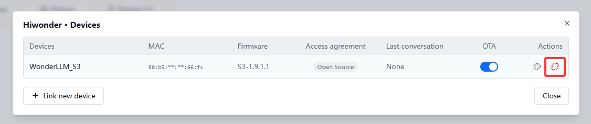

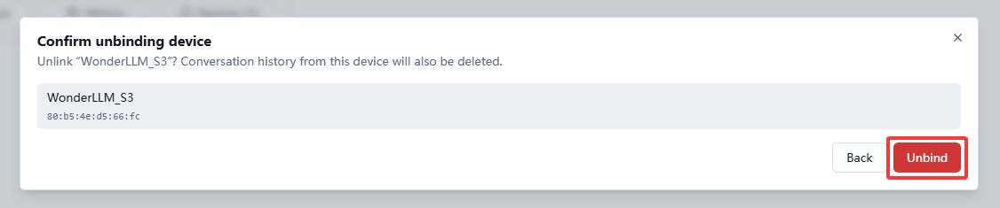

5. Upon successful unbinding, the prompt **Device unbound successfully** can be observed on the page.


<a id ="section-4-4-2-5"></a>

#### (5) Platform Developer Certification

> [!NOTE]
>
> **If the account has not completed GitHub certification, normal module usage is not affected, but available features are limited. Differences between uncertified and certified accounts are shown in the table below:**

|                           |        Unauthenticated         |                    Authenticated                     |
| :-----------------------: | :----------------------------: | :--------------------------------------------------: |
|      Model selection      |          Xiaozhi Lite          | Xiaozhi Lite, Qwen 3.6, DeepSeek V4, Doubao Seed 2.0 |
|  Number of bound devices  |               10               |                         100                          |
| Official service features | Weather, Music, Knowledge Base |      Weather, Joke, Music, News, Knowledge Base      |

- **Log In to GitHub Platform**

1. On the XiaoZhi platform, click **GitHub Verification** under the  icon. After the page jumps to the authentication interface, click **Link GitHub**.


2. Wait for the interface to jump to the GitHub account login page.


3. If a GitHub account is registered, log in directly using the username and password to jump to [Bind XiaoZhi Platform with GitHub Platform](#section-4-4-2-5-3). If no GitHub account is registered, click **Create an account**.


4. In the pop-up interface, enter personal email, login password, username, and location information in sequence, then click **Create account** to submit registration information.


5. Click **Visual puzzle** on the page to start image verification.


6. After completing image verification, the GitHub platform sends a verification email to the registered email address. Open the mailbox, copy the verification code, and enter it on the webpage.


7. After completing registration, the webpage jumps to the login page, where a registration success prompt pop-up window can be observed.


<a id ="section-4-4-2-5-3"></a>

- **Bind XiaoZhi Platform with GitHub Platform**

1. Click **Authorize tenclass** to complete binding between the XiaoZhi platform and GitHub platform.


2. After completing binding, XiaoZhi platform certification is complete, automatically returning to the previous certification page where prompt information appears.


3. Click **Agents** to return to the XiaoZhi AI agent console and create a new agent. All previously restricted configurations can be found fully unlocked.


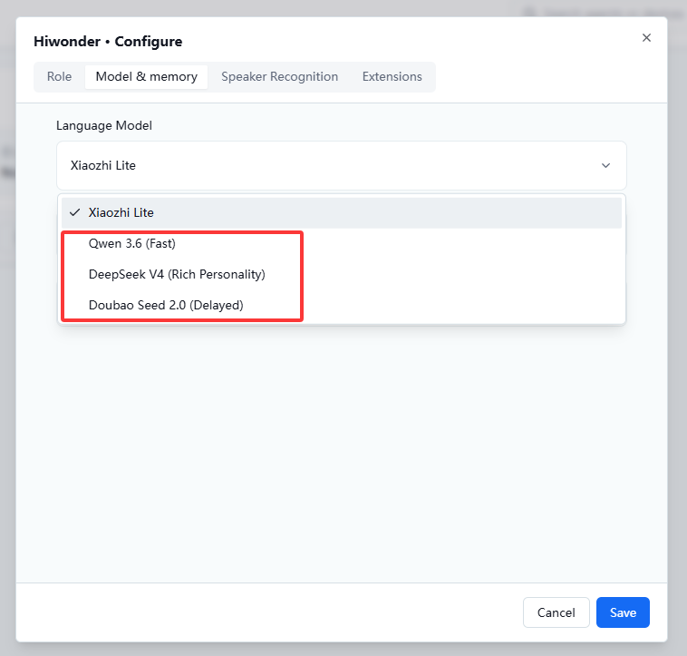

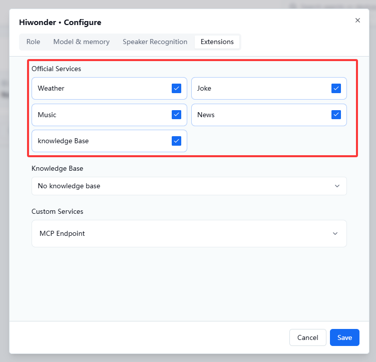

<a id ="section-4-4-2-6"></a>

#### (6) Device Restart

1. The module supports manual restart after power-on. Restart the module without disconnecting power using either of the following methods: **① Long press the left button, Button A**, or **② Long press the right button, Button B**.

2. When the module detects a restart command sent via a long button press, it turns off and restarts automatically. The screen turns off directly, at which point the button can be released and the module boots up automatically.

3. If restarting via **Long press the right button, Button B**, failing to release the button after the module powers on again may cause the module to falsely enter network configuration mode. Therefore, using a long press on the left button to achieve module restart is recommended.

<a id ="section-4-4-3"></a>

### 4.4.3 Volume Control

> [!NOTE]
>
> **Changing the volume while WonderLLM is speaking will take effect in the next round of speaking.**

#### (1) Screen Touch Control

1. After module power-on and successful connection to external hotspots, touch the screen to adjust module volume in two interfaces: ① Expression Interface and ② Chat Interface.

2. The operation method is as follows: slide anywhere on the screen. Sliding vertically upward automatically increases volume, while sliding vertically downward automatically decreases volume. The volume change magnitude depends on screen sliding distance, and adjusting volume via multiple screen slides is supported.

3. When sliding the screen to change volume, real-time volume values are displayed at the top center of the screen. The figure below takes sliding upward on the **Expression Interface** to increase volume as an example:


#### (2) Voice Interaction Control

1. During interaction with the WonderLLM large model module, issue volume adjustment commands to control module volume adjustment.

2. The operation method is as follows: say the wake word or short press the right button to enter the **Chat Interface**. At this time the module is activated. Refer to expressions such as: **① Set volume to xx, with valid range 0 to 100 supporting integers or percentages**, **② Increase volume, a fuzzy expression where the module adjusts volume automatically**.

3. After recognition, the dialogue box returns the volume adjustment function to be called, which does not require attention. Afterwards, the dialogue box displays the large model response statement accompanied by synchronized broadcast, where response statements are randomly generated by the large model module to ensure appropriate meaning.


<a id ="section-4-4-4"></a>

### 4.4.4 Chat Mode

#### (1) Mode Overview

1. In the current mode, the module listens to and understands spoken content, providing appropriate responses.

2. Switching relationships among module modes are shown in the figure below. Operations to **enter chat mode** are summarized as follows: in any other mode, say the wake word or short press the right button to enter chat mode.

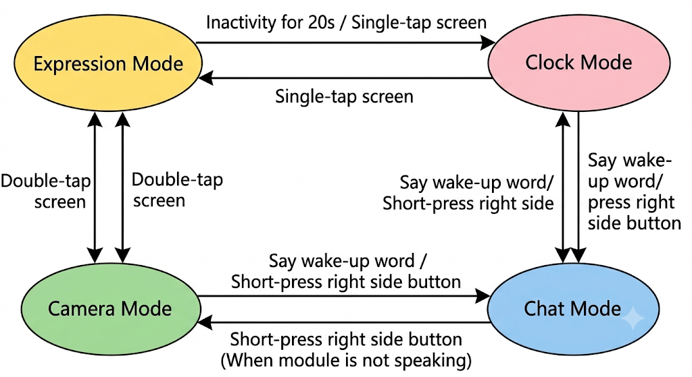

#### (2) Operation Instructions

1. After network configuration is completed, the module first enters the expression interface, as shown below:


2. Say the specified wake word **Hello Hiwonder**, or **short-press the right button B** to enter chat mode. A chime prompt tone can be heard from the buzzer, the screen switches to display the **Chat Box Interface**, and the module is successfully woken up to begin listening to spoken content.

3. If entering chat mode by **saying the wake word**, upon recognizing the wake word the module **sends 'Hello' by default as the opening remark**. The large model provides an appropriate response displayed on the chat box interface accompanied by synchronized broadcast, which can be interrupted to skip quickly as detailed in [Free Chat](#section-4-4-8), before listening to spoken content begins.


4. If entering chat mode by **short pressing the right button**, the module **starts listening immediately** to spoken content.


5. After entering chat mode and starting human-machine interaction, choose to **not display the chat box interface** and **maintain the expression interface continuously**, with specific operations detailed in [Expression Mode](#section-4-4-5).

<a id ="section-4-4-5"></a>

### 4.4.5 Expression Mode

> [!NOTE]
>
> * **If no wake word is spoken for more than 20 seconds on the expression interface, the module enters weather clock mode. Tap anywhere on the screen to return to expression mode.**
>
> * **Switching between the two modes here switches the display content screen of the module when entering chat mode.**
>
> * **During mode switching by short pressing the left button, the module continuously operates in Expression Mode. Short pressing the left button to switch to Chat Mode does not wake up the module to enter actual chat mode.**
>
> * **Specifically, if short pressing the left button switches the display interface in chat mode to Chat Mode, when activating the module by saying the wake word or short pressing the right button to start interaction, the module displays the chat box interface and large model response content.**
>
> * **If short pressing the left button switches the display interface in chat mode to Expression Mode, when activating the module by saying the wake word or short pressing the right button to start interaction, the module remains on the expression interface continuously and performs appropriate expression mimicry based on response content.**
>

#### (1) Mode Overview

1. In the current mode, the module mimics human facial expressions and demeanor.

2. Switching relationships among module modes are shown in the figure below. Operations to **enter expression mode** are summarized as follows: **① single-tap the screen in weather clock mode to enter expression mode**, **② double-tap the screen in camera mode to enter expression mode**, and **③ short press the right button in chat mode when the module is not speaking to enter expression mode**.


#### (2) Operation Instructions

1. In expression mode, short press the left button to switch between **Chat Mode** and **Expression Mode**. The current mode name is visible at the top of the screen.


2. After switching to **Expression Mode** by short pressing the left button, where screen display content entering chat mode is the expression interface, and activating the module to enter **Chat Mode** by saying the wake word or short pressing the right button to start interaction, the module performs expression mimicry based on spoken content. Calling methods mainly include two categories: **① describe specific events where the module automatically makes appropriate expression mimicry when replying**, and **② ask to perform a specific expression**.

<a id ="section-4-4-6"></a>

### 4.4.6 Weather Clock Mode

> [!NOTE]
>
> **In weather clock mode, single tap anywhere on the screen to return to expression mode, or enter chat mode by saying the wake word or short pressing the right button.**

#### (1) Mode Overview

1. In the current mode, the module obtains real-time weather and time information according to the set city and displays it.

2. Switching relationships among module modes are shown in the figure below. Operations to **enter weather clock mode** are summarized as follows: **① single-tap the screen or perform no operation for 20 seconds in expression mode to enter weather clock mode**. Camera mode and chat mode do not support direct switching to weather clock mode.


#### (2) Operation Instructions

1. Perform no operation for 20 seconds or single tap anywhere on the screen in expression mode to switch to weather clock mode.


2. After entering weather clock mode, the module remains in this mode continuously if no other operations are performed.

3. In this mode, the module screen displays the following content: **① real-time weather information and 2-day weather forecast for the location**, **② current Beijing time and date**, and **③ location city, with factory default set to Shenzhen, Guangdong**.

4. The module supports modifying the location city. Enter the chat interface to activate the module by saying the wake word or short pressing the right button, and issue commands to the WonderLLM module referring to expressions such as: **① modify city, where subsequent dialogue requires specifying the target city**, and **② switch location city to xx city**. After module reply, the location in weather clock mode switches synchronously.


<a id ="section-4-4-7"></a>

### 4.4.7 Camera Mode

#### (1) Mode Overview

1. In the current mode, the module calls the camera to continuously capture and display real-time images.

2. Switching relationships among module modes are shown in the figure below. Operations to **enter camera mode** are summarized as follows: **① double-tap the screen in expression mode to enter camera mode**. Weather clock mode and chat mode do not support direct switching to camera mode.


#### (2) Operation Instructions

1. **Double-tap** anywhere on the screen in expression mode to switch to camera mode.


2. In camera mode, the module calls the camera to **continuously capture** and display real-time images. The module remains in this mode continuously if no other operations are performed.

3. In camera mode, single tap anywhere on the screen to trigger the scene understanding function, as detailed in [Scene Understanding](#section-4-4-9).

<a id ="section-4-4-8"></a>

### 4.4.8 Free Chat

#### (1) General Operation Instructions

1. After module power-on and network configuration, wake up the module to enter chat mode by **saying the wake word or short pressing the right button**.

2. Speak freely while the module understands content via cloud large model interaction and provides text and voice replies. The module features memory capabilities supporting multi-round continuous dialogue.

3. After each round of interaction dialogue finishes, including after waking up WonderLLM, the module continues listening. If no spoken content is recognized within 1 continuous minute, listening stops automatically, and the large model replies with appropriate farewell remarks displayed on the chat box interface accompanied by synchronized broadcast. To continue interaction, wake up the module again by **saying the specified wake word or short pressing the right button**.

4. During human-machine interaction dialogue, actively end the dialogue by issuing commands to the WonderLLM module referring to expressions such as: **① Goodbye**, and **② Okay, stop here**. Upon receiving the command, the module replies with appropriate farewell remarks and ends listening.

5. The WonderLLM module supports voice interruption. When the module is speaking, including **① voice response to spoken content**, **② voice greeting**, and **③ voice farewell**, short press the right button to end current speech playback immediately and start listening to the next round of spoken content.

6. The WonderLLM module supports English recognition and speaking in English. Switch module operating language directly referring to expressions such as: **① Speak English**, **② Switch to English communication**.

#### (2) Special Feature Invocation

- **Feature Overview**

The module integrates special built-in features invoked by spoken commands during dialogue interaction. Issue commands to the WonderLLM module referring to expressions such as **① What can be done?** or **② Introduce features** to query all currently supported special features listed in the table below:

| Number | Feature | Number | Feature |
| :---: | :---: | :---: | :---: |
| 1 | Check weather | 4 | Tell jokes |
| 2 | Broadcast news | 5 | Check almanac |
| 3 | Outfit advice | 6 | Play music |

- **Invocation Examples**

Refer to the following expressions to issue commands to the WonderLLM module to invoke corresponding features:

1. Check weather feature: **Check the weather in xx area**.


2. Broadcast news feature: **① Broadcast today's news**, **② Introduce today's hot topics**.


3. Outfit advice feature: **What clothes are suitable for going out today?**


4. Tell jokes feature: **① Tell a joke**, **② Tell a funny joke**.


5. Check almanac feature: **Query today's almanac items**.


6. Play music feature: **Play a random music track**. 

   > [!NOTE]
   >
   > **When using the play music feature, lowering the module volume is recommended.**


<a id ="section-4-4-9"></a>

### 4.4.9 Scene Understanding

> [!NOTE]
>
> * **In scene understanding, continuous observation is not supported. The module captures a real-time image and analyzes it only after the feature is enabled by command.**
>
> * **In camera mode, double-tap again to return to the expression interface.**
>
> * **Before single-tap triggering in camera mode, the module only captures real-time images through the camera and displays them on the screen without calling the large model for analysis.**
>

#### (1) Voice Interaction Control

1. After power-on, enter the expression interface, then enter the chat interface to activate the module by saying the **wake word or short pressing the right button**.

2. Issue commands to the WonderLLM module referring to expressions such as: **① Describe what is seen ahead**, **② Take a photo**.

3. Upon understanding the command, the module camera starts to capture a real-time image displayed briefly on the screen for confirmation. The dialogue box returns the image capture function to be called, which does not require attention. Afterwards, the dialogue box displays image analysis statements from the large model accompanied by synchronized broadcast, where response statements are randomly generated by the large model module to ensure appropriate meaning.


#### (2) Screen Touch Trigger

1. **Double-tap** anywhere on the screen in expression mode to enter camera mode, where the screen displays real-time camera views ahead.


2. In camera mode, **tap** anywhere on the screen to capture a real-time image displayed briefly on the screen for confirmation before restoring to camera mode. The module automatically broadcasts image analysis statements, where response statements are randomly generated by the large model module to ensure appropriate meaning.

<a id ="section-4-4-10"></a>

### 4.4.10 Firmware Update

#### (1) ESP32-S3 Firmware Flashing

1. Connect the top Type-C interface of the WonderLLM module to the computer using a USB cable.


2. Open the **flash_download_tool_3.9.7.exe** file in the folder **[3. Appendix\2. WonderLLM Related Files\WonderLLM Flashing Tool\ESP32-S3 Firmware Flashing Tool\flash_download_tool_3.9.7](https://drive.google.com/drive/folders/1VT4wKRY0sFAQrTcgnuTOps3clNoc88w1?usp=sharing)**.


3. Select **ESP32-S3** for **ChipType**, keep default settings for others, then click **OK**.


4. After opening the tool, click **...** to select the program bin file to flash: open the **WonderLLM_S3_V1.9.0-EN.bin** file in the folder **[Appendix\WonderLLM Firmware Files\Online](https://drive.google.com/drive/folders/1GhlY747Im35TiNxDImEB4xVlcXIDP1lX?usp=sharing)**.


5. Check the box on the left side and configure remaining settings according to the figure below. Select the COM port occupied by the module. 

   > [!NOTE]
   >
   > **If configuring SPI MODE as DIO according to the figure results in abnormal module operation after firmware flashing, try configuring SPI MODE as DOUT and flash again.**


6. Click **ERASE** first to erase previously downloaded firmware, a mandatory step, and wait for the status bar to display **FINISH**.


7. Click **START** to download the selected firmware and wait for the progress bar to load, completing firmware downloading.


#### (2) CI1302 Firmware Flashing

1. Connect the bottom Type-C interface of the WonderLLM module to the computer using a USB cable.

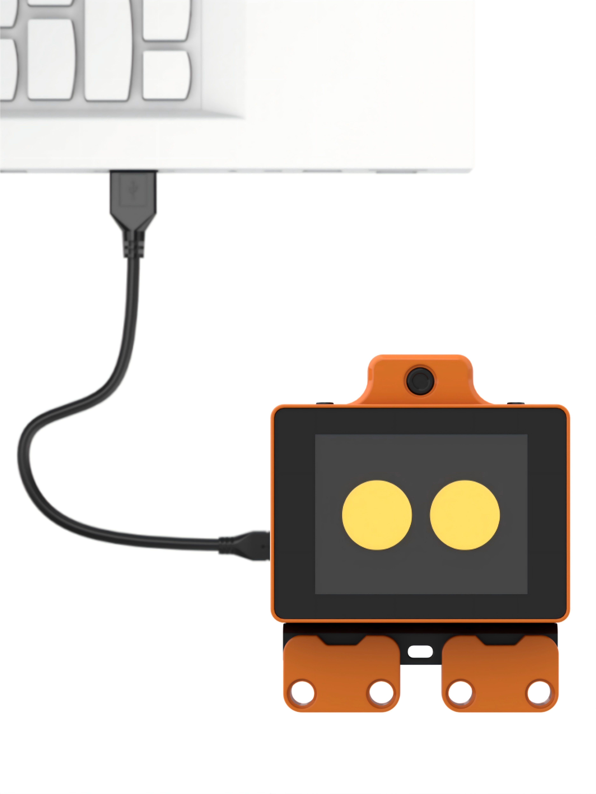

2. Open the **PACK_UPDATE_TOOL.exe** file in the folder **[3. Appendix\2. WonderLLM Related Files\WonderLLM Flashing Tool\CI1302 Firmware Flashing Tool](https://drive.google.com/drive/folders/1J_IZBq0eLWigoezojcnE9XaKbCIOjJLI?usp=sharing)**.


3. Select the **CI1302** chip, then click **Update**.


4. Click **Select firmware** to select the program bin file to flash: open the **CI1302-EN.bin** file in the folder **[Appendix\WonderLLM Firmware Files\Online](https://drive.google.com/drive/folders/1GhlY747Im35TiNxDImEB4xVlcXIDP1lX?usp=sharing)**.


5. Locate the corresponding serial port and click to select.


6. Next, **press and hold both left and right buttons A and B simultaneously** on the WonderLLM module to enter flashing mode, waiting for successful flashing.

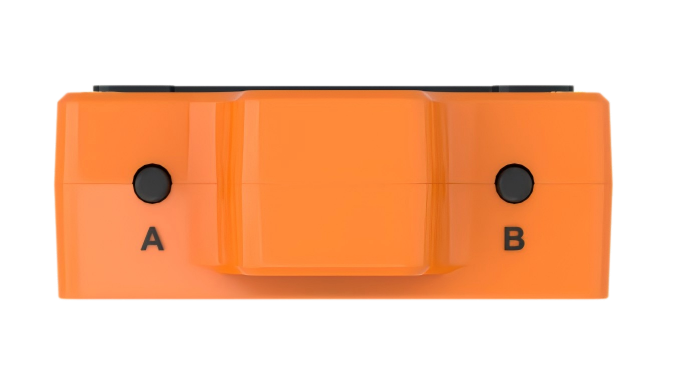


<p id ="section-4-5"></p>

## 4.5 WonderLLM Offline Version

<p id ="section-4-5-1"></p>

### 4.5.1 Firmware Update

#### (1) ESP32-S3 Firmware Flashing

1. Connect the top Type-C interface of the WonderLLM module to the computer using a USB cable.


2. Open the **flash_download_tool_3.9.7.exe** file in the folder **[3. Appendix\2. WonderLLM Related Files\WonderLLM Flashing Tool\ESP32-S3 Firmware Flashing Tool\flash_download_tool_3.9.7](https://drive.google.com/drive/folders/1VT4wKRY0sFAQrTcgnuTOps3clNoc88w1?usp=sharing)**.


3. Select **ESP32-S3** for **ChipType**, keep default settings for others, then click **OK**.


4. After opening the tool, click **...** to select the program bin file to flash: open the **WonderLLM_Echo_K12_EN.bin** file in the folder **[3. Appendix\2. WonderLLM Related Files\WonderLLM Firmware Files\Offline](https://drive.google.com/drive/folders/1aP3l_tDYIrCMCrs51QaVBYc_gvaAIAeg?usp=sharing)**.


5. Check the box on the left side and configure remaining settings according to the figure below. Select the COM port occupied by the module. 

   > [!NOTE]
   >
   > **If configuring SPI MODE as DIO according to the figure results in abnormal module operation after firmware flashing, try configuring SPI MODE as DOUT and flash again.**


6. Click **ERASE** first to erase previously downloaded firmware, a mandatory step, and wait for the status bar to display **FINISH**.

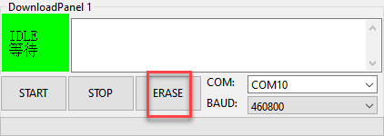


7. Click **START** to download the selected firmware and wait for the progress bar to load, completing firmware downloading.


#### (2) CI1302 Firmware Flashing

1. Connect the bottom Type-C interface of the WonderLLM module to the computer using a USB cable.


2. Open the **PACK_UPDATE_TOOL.exe** file in the folder **[3. Appendix\2. WonderLLM Related Files\WonderLLM Flashing Tool\CI1302 Firmware Flashing Tool](https://drive.google.com/drive/folders/1J_IZBq0eLWigoezojcnE9XaKbCIOjJLI?usp=sharing)**.


3. Select the **CI1302** chip, then click **Update**.

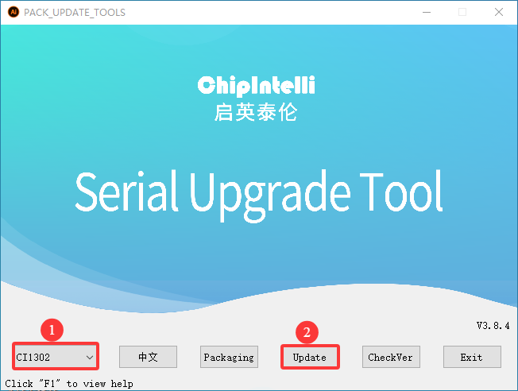

4. Click **Select firmware** to select the program bin file to flash: open the **CI1302_K12_EN.bin** file in the folder **[3. Appendix\2. WonderLLM Related Files\WonderLLM Firmware Files\Offline](https://drive.google.com/drive/folders/1aP3l_tDYIrCMCrs51QaVBYc_gvaAIAeg?usp=sharing)**.


5. Locate the corresponding serial port and click to select.


6. Next, **press and hold both left and right buttons A and B simultaneously** on the WonderLLM module to enter flashing mode, waiting for successful flashing.


### 4.5.2 Voice Interaction Mode

1. After updating both firmwares to offline versions, the module first enters **Standby** state.


2. In any mode, **long press the right button, Button B** to enter voice interaction mode.


3. Activate the module to enter **Voice Interaction Mode** by saying the wake word, **Hello Hiwonder**, and the module responds **I'm here**.

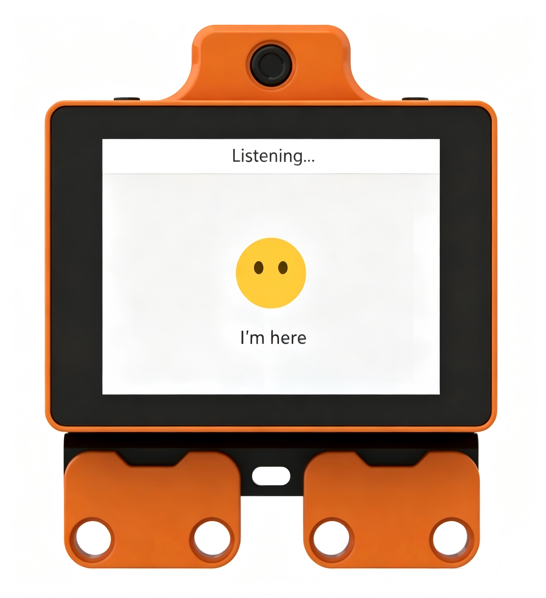

4. After entering voice interaction mode, the module provides directional message replies according to specified commands. Frequently used voice entries are listed below, with further detailed entries in the appendix.

| Voice ID | Command Word | Broadcast Phrase |
| :---: | :---: | :---: |
| / | Hello Hiwonder | I am here |
| / | Volume up | Increasing volume |
| / | Volume down | Decreasing volume |
| / | Maximum volume | Maximum volume |
| / | Medium volume | Medium volume |
| / | Minimum volume | Minimum volume |
| 26 | Hello | Hello |
| 27 | Introduce yourself | I am Hiwonder robot, able to talk and dance |
| 15 | Welcome | Hello, welcome |
| 1 | Move forward | Moving forward |
| 2 | Move backward | Moving backward |
| 3 | Turn left | Turning left |
| 4 | Turn right | Turning right |
| 9 | Stop | Received |
| 13 | Speed up | Speed up |
| 14 | Speed down | Speed down |
| 186 | Move left | Moving left |
| 187 | Move right | Moving right |
| 18 | Turn on light | Light on |
| 19 | Turn off light | Light off |
| 39 | Red light | Okay |
| 40 | Green light | Okay |
| 41 | Blue light | Okay |
| 20 | Open door | Door opened |
| 21 | Close door | Door closed |
| 24 | Extend drying rack | Extended |
| 25 | Retract drying rack | Retracted |
| 36 | Turn on fan | Okay |
| 37 | Turn off fan | Okay |
| 38 | Rotate servo | Okay |
| 181 | Happy expression | Okay |
| 182 | Sad expression | Okay |
| 183 | Helpless expression | Okay |
| 184 | Expectant expression | Okay |

5. After each round of interaction dialogue finishes, including after waking up WonderLLM, the module continues listening. If no spoken content is recognized within 1 continuous minute, listening stops automatically and the module switches to the sleep interface automatically. To continue interaction, wake up the module again by **saying the specified wake word**.


### 4.5.3 Face Recognition Mode

In any mode, **short press the right button, Button B** to enter face recognition mode.


### 4.5.4 Color Recognition Mode

In any mode, **short press the left button, Button A** to enter color recognition mode.


Color IDs correspond to colors as follows:

| Color ID | Color |
| :---: | :---: |
| 1 | Red |
| 2 | Orange |
| 3 | Green |
| 4 | Blue |
| 5 | Black |


