# 2. Quick Start

## 2.1 LLM Interaction

> [!NOTE]
>
> **This section is introduced to quickly get started with the WonderLLM module. For detailed and diverse feature, refer to [4.4 WonderLLM Module](https://wiki.hiwonder.com/projects/DaDablock-AI/en/ultimate-kit/docs/4_Software_and_Hardware_Guide.html#_4-4-wonderllm-module) for learning.**

### 2.1.1 Powering On the Device

1. The module supports power supply through three interfaces: **① Type-C interface on the top**, **② Type-C interface on the bottom**, and **③ 4-PIN I2C communication interface**. Connect an external power supply device to any interface to automatically power on the module.


2. After powering on the module, the screen displays the **device hotspot name** and **browser network configuration URL** accompanied by a voice announcement. Complete the module device network connection first according to [Network Configuration](#section-2-1-2).


3. After completing network configuration, the module needs to be bound to the platform agent. The screen displays the **device ID** and **device binding platform URL** accompanied by a voice announcement of the verification code. Complete the device binding according to [Device Binding](#section-2-1-4).

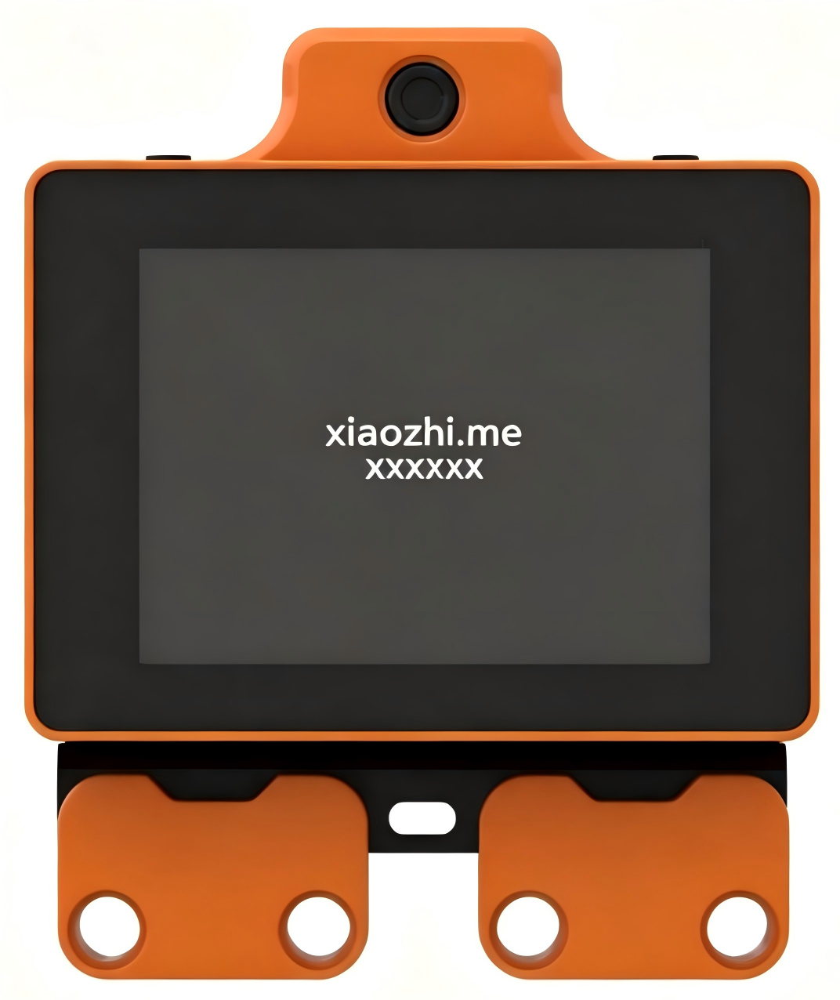

4. After powering on, if device binding has been completed, a white circular scroll bar is displayed on the screen while the module automatically connects to the network using the Wi-Fi information saved in internal storage. If network connection fails, the screen displays the **device hotspot name** and **browser network configuration URL** accompanied by a voice announcement. Reconfigure new Wi-Fi connection details available in the current environment according to [Network Configuration](#section-2-1-2).


5. After powering on, if device binding has been completed and the configured Wi-Fi connection information is available in the current environment, the network connects successfully after the white circular scroll bar loads for a period, jumping to the expression display interface of the module. At this point, all configurations of the module are normal, and human-robot interaction can start after waking up the module.


<a id ="section-2-1-2"></a>

### 2.1.2 Connecting the Module to the Network

1. After powering on, the module starts the network connection operation. The screen displays the **device hotspot name** and **browser network configuration URL** accompanied by a voice announcement. The LLM module opens its built-in hotspot for connection and configuration. Different devices have different hotspot names, formatted uniformly as **Robot-xxxx**. The hotspot **Robot-B7B9** is used as an example below.


2. Search for the corresponding hotspot using a computer or mobile phone and connect, with no password required for this hotspot.

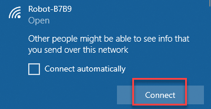


3. Click the [Network Configuration](http://192.168.4.1/) hyperlink to directly access the device network configuration URL, or copy the URL below, open any browser, and enter the device network configuration URL.

```py
http://192.168.4.1
```


4. Enter the desired hotspot name for automatic connection upon power-on in area ① in the figure below, and enter the connection password in area ②. Finally, click **Connect** in area ③. The module will attempt to search for and connect to a matching hotspot in the current environment based on the provided connection details.


5. A list of available hotspots in the current environment scanned by the module can be found on the interface. Clicking an item will automatically fill the corresponding hotspot name into area ①, which is more convenient and time-saving.


6. If the following prompt appears on the interface, it indicates that the hotspot cannot be found in the current environment or the connection password is incorrect. Please re-enter the details.

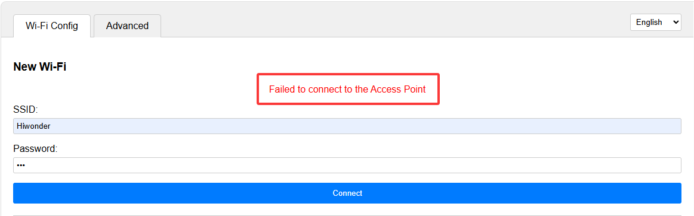

7. If the following prompt appears on the interface, it indicates that the module has successfully found and connected to the corresponding hotspot. The module will automatically restart and connect to the corresponding hotspot.


> [!NOTE]
>
> * **Do not enter hotspots that cannot be searched in the current environment, have excessively weak signals, or do not support network connection features.**
>
> * **If connection details of other hotspots were saved previously, newly saved connection details will coexist with them. Upon the next power-on operation, the module reads each saved connection detail in order to attempt matching and connecting to hotspots.**
>
> * **If the prompt "Error: Failed to check for new version, will retry in xx seconds" appears on the screen after network configuration is completed, it may be due to the current hotspot being unable to access the Internet or poor network quality. Please try switching networks.**
>

<a id ="section-2-1-3"></a>

### 2.1.3 XiaoZhi Platform Account Registration and Authentication

> [!NOTE]
>
> **If GitHub authentication is not completed for the account, module usage is not affected, but available features are limited. Differences between unauthenticated and authenticated accounts are shown in the table below:**

|                           |        Unauthenticated         |                    Authenticated                     |
| :-----------------------: | :----------------------------: | :--------------------------------------------------: |
|      Model selection      |          Xiaozhi Lite          | Xiaozhi Lite, Qwen 3.6, DeepSeek V4, Doubao Seed 2.0 |
|  Number of bound devices  |               10               |                         100                          |
| Official service features | Weather, Music, Knowledge Base |      Weather, Joke, Music, News, Knowledge Base      |

- **XiaoZhi AI Platform Account Registration**

1. Click the [XiaoZhi AI Chatbot](https://xiaozhi.me/) hyperlink to directly access the device binding URL, or copy the URL below, open any browser, and enter the device binding URL.

```py
https://xiaozhi.me
```


2. Click **Console** to enter the XiaoZhi AI Agent Management Platform.


3. For initial login, register a platform account first.

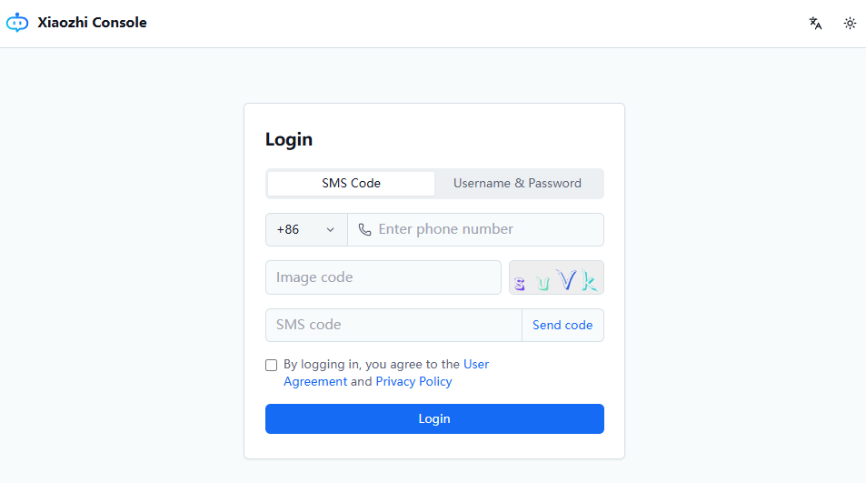

4. After filling in the corresponding information, click **Send code** to obtain the verification code required for account registration.


5. Check the box to agree to the terms of service and privacy policy, and then click **Login**.


6. Select and complete the corresponding information, then click **Confirm** to complete registration and login.


- **Logging in to GitHub Platform**

1. On the XiaoZhi platform, click **GitHub Verification** under the  icon. After the interface jumps to the authentication page, click **Link GitHub**.

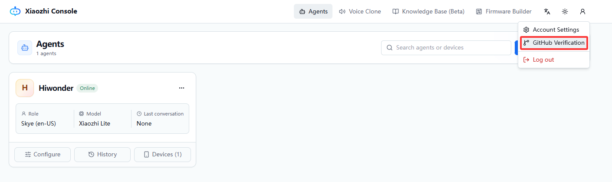

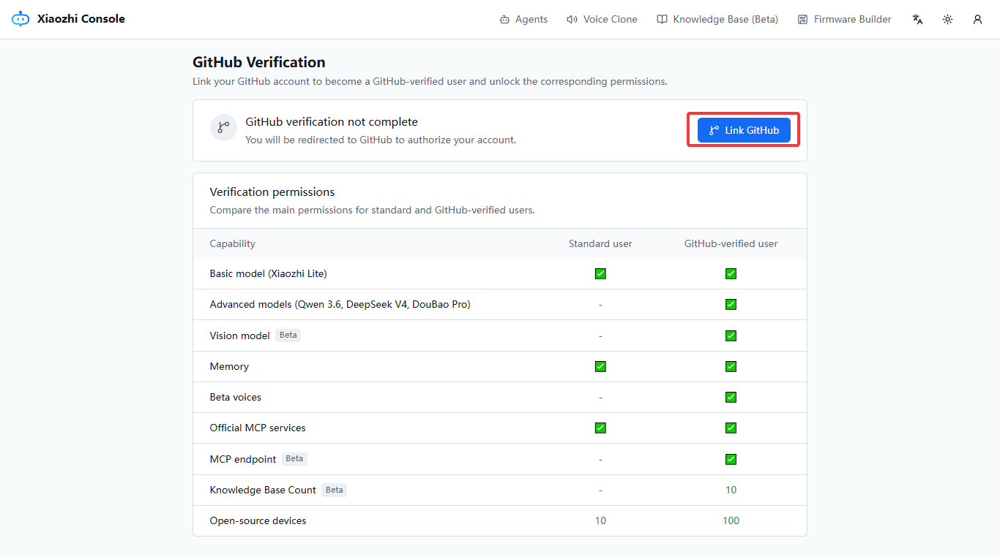

2. Wait for the page to jump to the GitHub account login page.

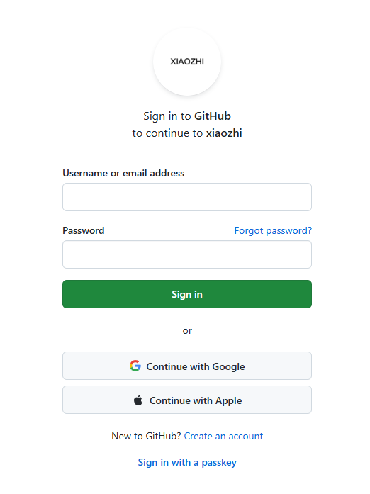

3. If a GitHub account has already been registered, enter the username and password to log in directly and jump to [Binding XiaoZhi Platform and GitHub Platform](#section-2-1-3-3). If no GitHub account has been registered, click **Create an account**.

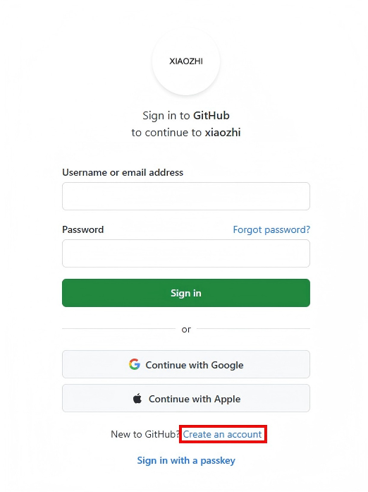

4. Enter the personal email, login password, username, and location details in sequence on the pop-up interface, and click **Create account** to submit the registration information.


5. Click **Visual puzzle** on the page to start image verification.


6. After completing image verification, the GitHub platform will send a verification email to the registered email address entered previously. Open the email, copy the verification code, and enter it on the web page.


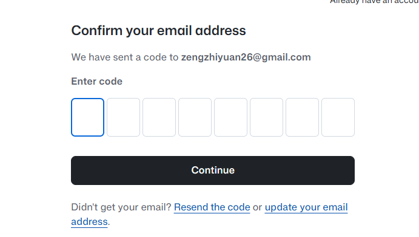

7. After completing registration, the web page jumps to the login page, and a pop-up window indicating successful registration is displayed.


<a id ="section-2-1-3-3"></a>

- **Binding XiaoZhi Platform and GitHub Platform**

1. Click **Authorize tenclass** to complete the binding between the XiaoZhi platform and the GitHub platform.

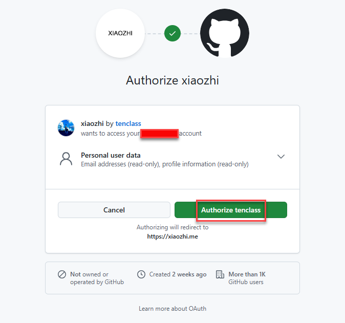

2. After completing the binding, authentication on the XiaoZhi platform is fully completed, automatically returning to the previous authentication page where the following prompt appears.


<a id ="section-2-1-4"></a>

### 2.1.4 Device Binding

1. After completing registration, login, and authentication on the XiaoZhi platform, click **Agents** to enter the following interface.


2. Click the **∨** button next to the add device button, and then click **Create Agent**.


3. Fill in the agent name, and then click **Confirm** to complete adding the agent.


4. Click **Configure** to configure various functions for the agent.


5. Click **Role** to configure the role of the agent. Select the desired dialogue language in area ①, select the desired role voice in area ②, and adjust voice settings in area ③.


6. Click **Model & Memory**, select **DeepSeek V4 (Rich Personality)** for the language model option, disable the memory feature, and keep all other options as default.


7. Click **Extensions**, check all official service features, keep all other options as default, and finally click **Save**.


8. Click **Devices** to enter the device management feature.


9. Click **Link new device**, enter the **6-digit device ID** in the pop-up window, and click **Link**.


10. If the binding is successful, the prompt **Device Added Successfully** is displayed on the page. Then select **Open Source Version** and click **Start Using**.


### 2.1.5 Free Chat

- **Function Overview**

The module has built-in special functions that can be triggered by voice commands during human-robot dialogue interactions. Refer to the following phrases to send commands to the WonderLLM module to query all currently supported special functions: **① What features are available?** and **② Introduce available functions.** The special functions currently supported by the module are listed below:

- **Invocation Examples**

Refer to the following phrases to send commands to the WonderLLM module to trigger corresponding special functions:

1. Weather query function: **Check the weather in xx region.**


2. News broadcast function: **① Broadcast today's news** or **② Tell me about today's trending events.**


3. Outfit advice function: **What is a suitable outfit for going out today?**


4. Joke telling function: **① Tell a joke** or **② Tell a joke to entertain.**


5. Almanac query function: **Check today's almanac items.**

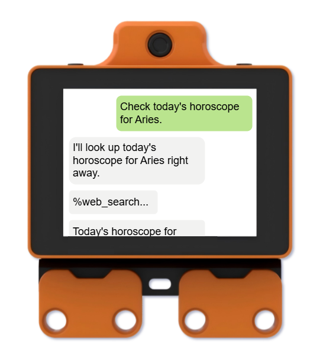

6. Music playback function: **Play a random song.** 

   > [!NOTE]
   >
   > **It is recommended to lower the module volume when using the music playback function.**


## 2.2 Hardware Preparation

### 2.2.1 Powering On

1. Insert the battery into the battery slot at the bottom of the controller. 

   > [!NOTE]
   >
   > **Do not reverse the positive and negative poles.**


2. Turn on the power switch. The red power indicator light on the controller glowing red indicates successful powering on.


> [!NOTE]
>
> **When powering on for the first time, follow the steps in Section 2.2.2 Charging to charge through the charging port for about 5 seconds to activate the built-in battery protection chip. If the battery is not removed after activation, no further activation is required in the future.**

### 2.2.2 Charging

1. Ensure the power switch of the controller is set to the **OFF** position. Connect one end of the USB cable to the charging interface of the controller and the other end to the charger.


2. During charging, the LED indicator on the controller glows blue. Once fully charged, the LED turns off. Unplug the power cable promptly after charging is complete to avoid overcharging.


> [!NOTE]
>
> **The power switch must be turned off during charging, otherwise the battery cannot be fully charged. Unplug the charger and power supply promptly after charging is complete to avoid overcharging and damaging the battery. Someone must be present during charging.**

## 2.3 Software Configuration

### 2.3.1 WonderCode Software Package

- [WonderCode Windows Version](https://drive.google.com/file/d/1X8SvOM01UXOM2IvFwN_Ty7Ert5NPqZr8/view?usp=sharing)

- [WonderCode Mac Version](https://hiwonder.com.cn/download/pcSoftware?get_pc=1&os=mac)

### 2.3.2 Installing the WonderCode

1. Open the **WonderCode setup.exe** software installation package.


2. Select the language, and then click **OK**.


3. Choose the installation location, and then click **Next**.

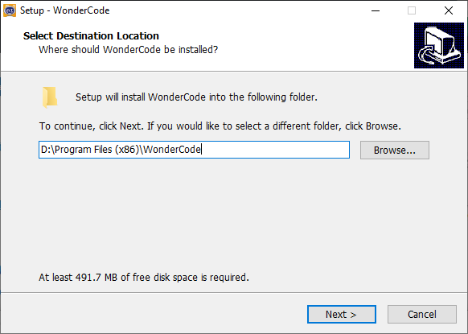

4. Click **Next**.

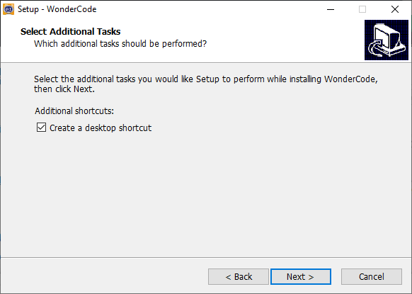

5. Click **Install**.


6. After successful installation, click **Finish**.


## 2.4 Starter Project 1: Onboard RGB Light Flashing

### 2.4.1 Programming

1. Create a new file: Open the programming software and create a new project.

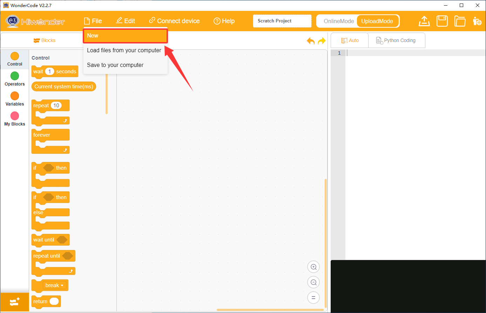

2. Add extensions:

- Click the extension button in the bottom left corner.


- Select **Controller** in the **Choose an Extension** interface to add **K12 ESP32**.

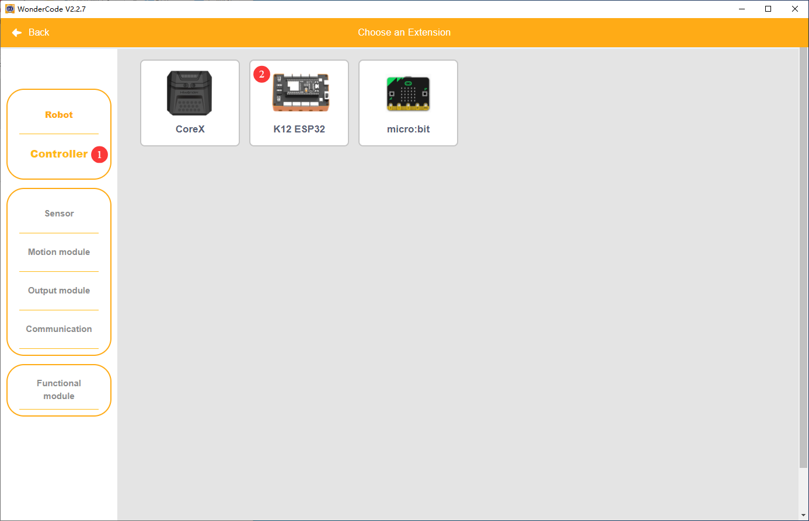

- After successful addition, the added extension package is visible on the WonderCode interface.


3. Program:
   
- Drag the corresponding blocks from the block palette to the scripting area to program. Once programmed successfully, the Python program converted from the blocks is visible in the code display and upload area.

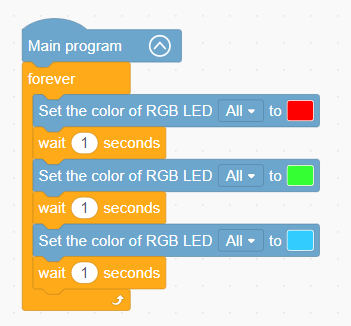

* The source files are available for download under [1. Source Code / 03 Program Files for Starter Projects](https://drive.google.com/drive/folders/1C_cT51H9adfUnSPw9l57vPrQQ2A_vUBa?usp=sharing).

### 2.4.2 Downloading the Program


> [!NOTE]
>
> **The connected port number is not unique. The port number connected in this section is COM3. Do not connect to COM1 as it is typically the interface for system communication. If multiple COM ports are displayed and cannot be determined, right-click This PC, click Properties -> Device Manager in sequence, and check the port number corresponding to the controller, where the port containing the CH340 label is the correct port.**


### 2.4.3 Program Outcome

After downloading the program successfully, the two onboard RGB lights of the controller switch colors every 1 second, in the sequence of red, green, and blue.

> [!NOTE]
>
> **The following starter projects are designed to facilitate a quick start with the electronic modules used in this kit. For detailed descriptions of the modules, refer to [4.3 Electronic Modules Overview](https://wiki.hiwonder.com/projects/DaDablock-AI/en/ultimate-kit/docs/4_Software_and_Hardware_Guide.html#_4-3-electronic-modules-overview) for learning.**

## 2.5 Starter Project 2: Dual Servos and Dot Matrix Graphics Display

### 2.5.1 Learning Objectives

1. Understand the dot matrix module and master the basic usage of displaying preset expression patterns on the dot matrix.

2. Master the angle adjustment method for the ESP32 controller to control the 270° servo, and understand the logic of variable control for servo movement.

3. Master the speed and direction regulation methods for the ESP32 controller to control the DC motor, and understand the control logic of forward rotation, reverse rotation, and stopping.

### 2.5.2 Wiring Diagram

Connect the dot matrix module cable to port **P5** of the ESP32 controller.

Connect the 270° block servo cable to port **S1** of the ESP32 controller, and insert the **orange** wire of the servo into the **white** pin of S1.

Connect the 360° block servo cable to port **S2** of the ESP32 controller, and insert the **orange** wire of the servo into the **white** pin of S2.

As shown in the figure:

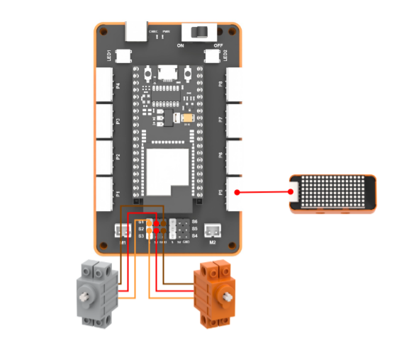

### 2.5.3 Programming

#### 1. Adding Extension Libraries

Select **Output module** in the **Choose an Extension** interface to add the **Dot matrix module**.

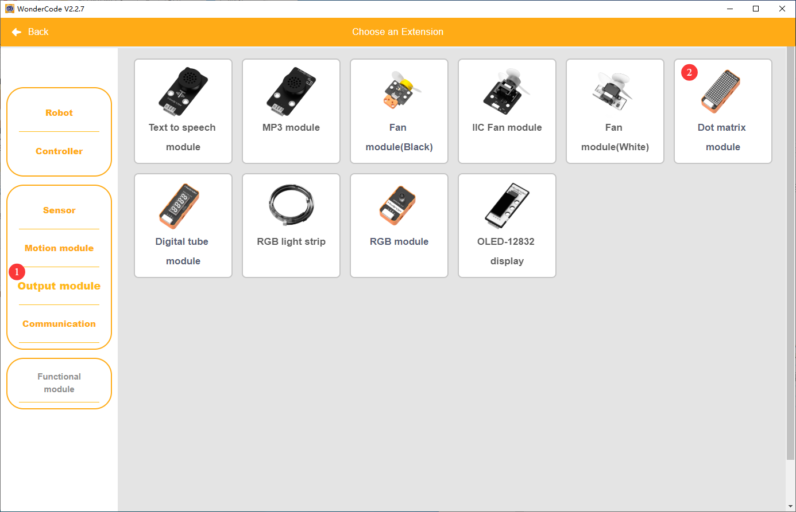

#### 2. Program Display

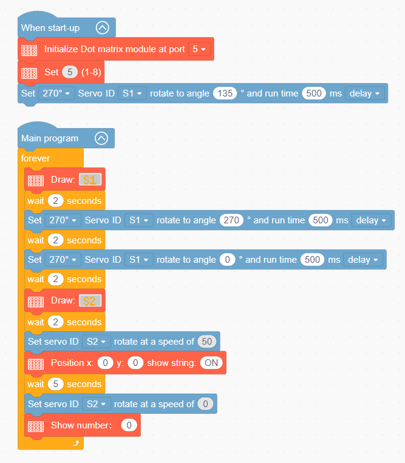

* The source files are available for download under [1. Source Code / 03 Program Files for Starter Projects](https://drive.google.com/drive/folders/1C_cT51H9adfUnSPw9l57vPrQQ2A_vUBa?usp=sharing).

### 2.5.4 Downloading the Program


### 2.5.5 Program Outcome

After the program is downloaded successfully, the interface of the dot matrix screen is initialized and its brightness is set, and the 270° block servo connected to port `S1` rotates to `135°`. Then the following loop executes: the dot matrix screen draws pattern `S1` and waits for `2` seconds, the `S1` servo rotates to `270°` and `0°` in sequence, waiting for `2` seconds after each rotation. The dot matrix screen then draws pattern `S2` and waits for `2` seconds, the 360° block servo connected to port `S2` rotates at a speed of `50` while the dot matrix screen displays text `ON`. After waiting for `5` seconds, the `S2` servo stops and the dot matrix screen displays number `0`.

## 2.6 Starter Project 3: Fan Control

### 2.6.1 Learning Objectives

1. Understand the functions of the fan module and master the control methods for turning the fan on and off.

### 2.6.2 Wiring Diagram

Connect the fan module cable to port **5** of the ESP32 controller, as shown in the figure:


### 2.6.3 Programming

#### 1. Adding Extension Libraries

Select **Output module** in the **Choose an Extension** interface to add the **Fan module (Black)**.


#### 2. Program Display

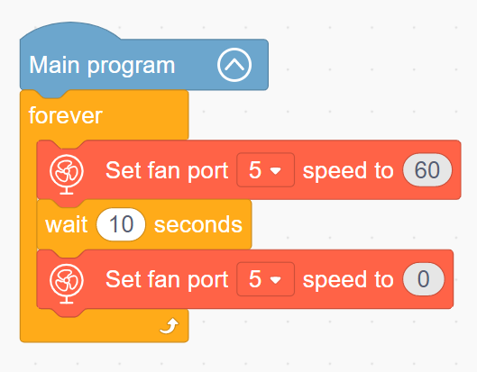

* The source files are available for download under [1. Source Code / 03 Program Files for Starter Projects](https://drive.google.com/drive/folders/1C_cT51H9adfUnSPw9l57vPrQQ2A_vUBa?usp=sharing).

### 2.6.4 Downloading the Program


### 2.6.5 Program Outcome

After downloading the program, the fan rotates at a speed of `60` and stops rotating after `10` seconds.

## 2.7 Starter Project 4: 4-Channel Line Follower, Temperature and Humidity, Glowing Ultrasonic, and Light Sensor Coordination

### 2.7.1 Learning Objectives

1. Understand the functions of the glowing ultrasonic sensor and its role in detecting distance.

2. Understand the functions of the light sensor and its role in sensing ambient light intensity.

3. Understand the functions of the temperature and humidity sensor and learn how to read temperature and humidity values.

4. Understand the functions of the 4-channel line follower sensor and learn how to read the detection status of the line follower sensor.

### 2.7.2 Wiring Diagram

Connect the 4-channel line follower sensor cable to port **1** of the ESP32 controller.

Connect the glowing ultrasonic sensor cable to port **2** of the ESP32 controller.

Connect the temperature and humidity sensor cable to port **3** of the ESP32 controller.

Connect the light sensor cable to port **5** of the ESP32 controller.

As shown in the figure:


### 2.7.3 Programming

#### 1. Adding Extension Libraries

Select **Sensors** in the **Choose an Extension** interface to add the **Glowy ultrasonic sensor**, **Light sensor**, **Temperature and humidity sensor**, and **4-channel line follower sensor**.

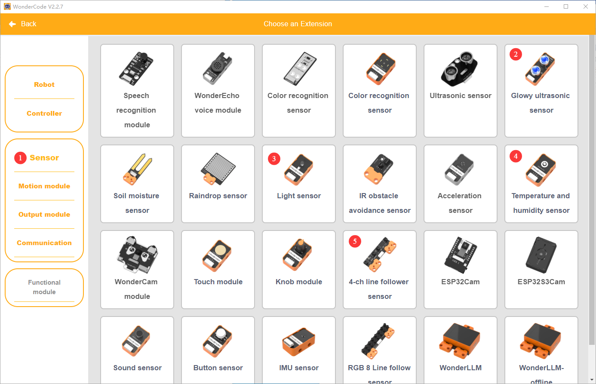

#### 2. Program Display

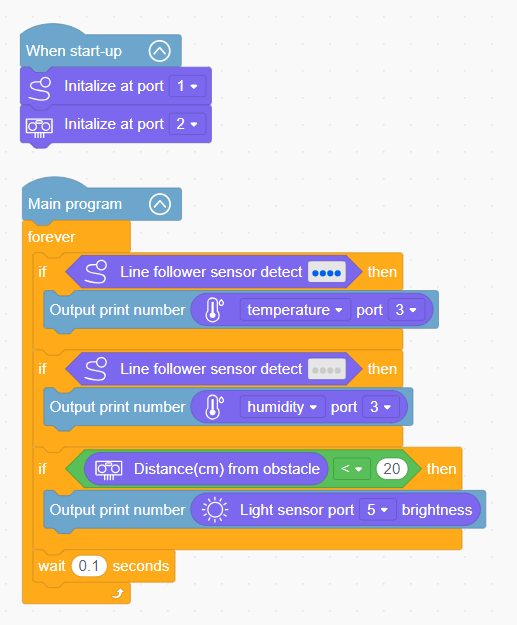

* The source files are available for download under [1. Source Code / 03 Program Files for Starter Projects](https://drive.google.com/drive/folders/1C_cT51H9adfUnSPw9l57vPrQQ2A_vUBa?usp=sharing).

### 2.7.4 Downloading the Program


### 2.7.5 Program Outcome

After the program is successfully downloaded, 4-channel line follower sensor port `1` and ultrasonic sensor port `2` are initialized first. Then the following loop executes: if all four probes of the 4-channel line follower sensor detect black lines, the temperature value is printed to the serial port, if the 4-channel line follower sensor detects white ground, the humidity value is printed to the serial port, and if the obstacle distance detected by the ultrasonic sensor is less than `20` cm, the light intensity value is printed to the serial port.


